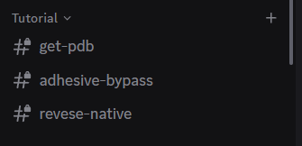
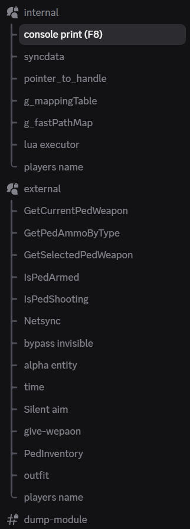

# 🚀 FiveM Offsets & Native References

Welcome to the **Free FiveM Offsets** – a free and actively maintained repository for internal and external offsets used in reverse engineering, modding, and cheat development in **FiveM**.

> ✅ Free to use — constantly updated — developer-friendly

---
### 🌐 global offsets 1604 - 3407 !
## 📌 Many Features !
### 🔒 Internal !
### 🌐 External !

---

## 🧪 Tutorials
- [get-pdb](#)
- [adhesive-bypass](#)
- [reverse-native](#)

---

## 📷 Screenshots

---

## 💬 Join Our Discord

For updates, discussions, and support —  
👉 **[Click here to join Discord](https://discord.gg/YOUR_INVITE_CODE)**

---

## 🛠️ Contributions

Request the offsets you want via a ticket on discord.

